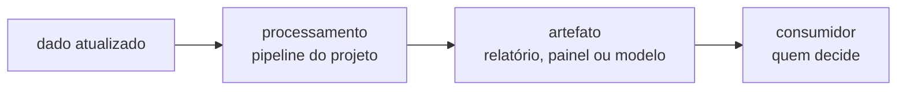

# Implementação

Um resultado só é útil quando quem decide consegue acessá-lo. Esta página descreve **como a
entrega chega ao usuário**, como ela é mantida em funcionamento e como o projeto é encerrado.

!!! tip "Como preencher esta página"
    A complexidade desta fase varia muito: pode ser um relatório recorrente, um painel, um
    arquivo publicado em rede ou um serviço em produção. Descreva o que se aplica ao seu
    caso e remova o resto.

    Regras práticas:

    - defina o **consumidor** da entrega antes do meio: quem abre, com que frequência e para
      decidir o quê;
    - descreva como a entrega é **atualizada** — entrega que só existe porque alguém rodou o
      notebook uma vez não está implantada;
    - modelo em produção **degrada**: sem plano de monitoramento, a fase de implantação está
      incompleta;
    - registre o que acontece **quando falha** — quem é avisado e qual é o comportamento
      esperado enquanto não há dado novo;
    - encerre com o relatório final e a retrospectiva, senão o aprendizado fica só no
      repositório.

## Plano de implantação

**Descreva a forma da entrega e por que ela foi escolhida.**

| Entrega | Consumidor | Meio | Frequência |
|:---|:---|:---|:---|
| &lt;o que é entregue&gt; | &lt;quem consome&gt; | &lt;relatório, painel, arquivo, API&gt; | &lt;sob demanda, mensal, diária&gt; |

**Indique o que dispara a atualização (execução manual, agendamento,
chegada de dado novo) e onde o artefato é publicado.**

## Monitoramento e manutenção

**Defina o que é acompanhado depois da entrega e com que
periodicidade.**

| O que monitorar | Como | Periodicidade | Ação se desviar |
|:---|:---|:---|:---|
| &lt;indicador&gt; | &lt;forma de medição&gt; | &lt;periodicidade&gt; | &lt;o que fazer&gt; |

??? note "O que costuma ser monitorado"
    - **execução**: a carga rodou, no horário previsto, sem erro;
    - **volumetria**: o volume recebido está dentro do esperado — queda brusca costuma ser
      falha de origem, não mudança de comportamento;
    - **qualidade**: percentual de nulos e cardinalidade das dimensões-chave estáveis;
    - **desempenho do modelo**, quando houver: as métricas se mantêm em produção;
    - **desvio de distribuição**: os dados de entrada continuam parecidos com os de treino.

**Registre quem é acionado quando algo falha e qual é o
comportamento esperado enquanto o problema não é resolvido.**

### Retreinamento

**Se houver modelo, diga quando ele é retreinado — por calendário,
por queda de métrica ou por desvio de distribuição — e o que é preciso para reproduzir o
treino.**

## Relatório final

**Aponte onde está o relatório que consolida todas as fases do
projeto e, se houver, a apresentação de fechamento.**

| Artefato | Local |
|:---|:---|
| Relatório final | `docs/<arquivo>` ou `reports/<arquivo>` |
| Apresentação | `docs/apresentacoes/<arquivo>` |

## Revisão do projeto

Retrospectiva de fechamento — o que levar para o próximo projeto.

- **O que deu certo** — **a repetir.**
- **O que poderia ter sido melhor** — **sem atribuir culpa; o alvo é
  o processo.**
- **O que fazer diferente** — **mudanças concretas de prática.**

**Registre também o que fica sob responsabilidade de quem após o
encerramento: manutenção, acesso aos dados e ponto de contato.**
