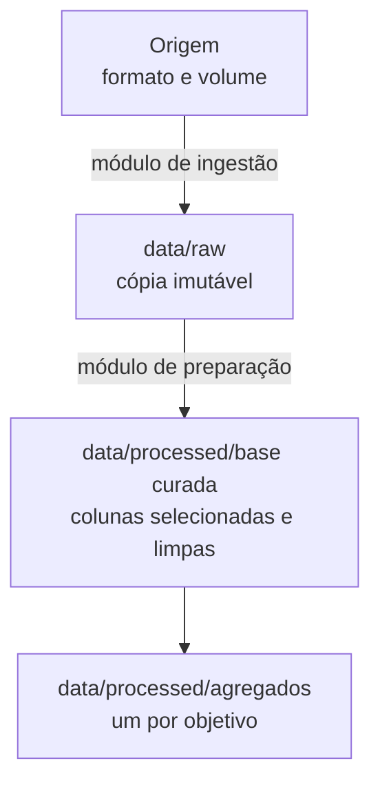

# Preparação dos dados

Esta página descreve **o que foi feito com os dados** entre a origem e a análise: como eles
são materializados, que regras de limpeza foram aplicadas e como a transformação é
conferida.

!!! tip "Como preencher esta página"
    Preencha em par com [Entendimento dos dados](entendimento-dados.md): lá ficam os achados
    de qualidade, aqui ficam as decisões tomadas a respeito deles.

    Regras práticas:

    - separe os dados em **camadas** e trate a camada bruta como imutável — reprocessar deve
      sempre partir dela, nunca de um arquivo editado à mão;
    - toda regra de limpeza vem acompanhada do **motivo**; regra sem motivo é removida na
      primeira refatoração e o problema volta;
    - a carga precisa ser **idempotente**: reexecutar não pode duplicar dado nem exigir
      recomeçar do zero;
    - registre as **conferências** que provam que a transformação não perdeu nem inventou
      dado — é o que permite confiar nos números depois;
    - decisão sobre outlier é decisão de negócio, não de código: declare se o extremo é
      legítimo e o que foi feito com ele.

## Arquitetura em camadas



| Camada | Diretório | Papel |
|:---|:---|:---|
| Bruta | `data/raw` | cópia imutável da origem |
| Curada | `data/processed/<base curada>` | colunas selecionadas, tipadas e limpas |
| Agregada | `data/processed/<agregados>` | um agregado por objetivo de negócio |

## Materialização da camada bruta

<span style="color:red">**Explique como a origem é copiada para `data/raw`: em que
granularidade, em que formato e por quê.**</span>

```
data/raw/nome_do_arquivo_particao=valor.parquet
```

<span style="color:red">**Diga se a operação é idempotente e o que garante isso (manifesto,
arquivo de controle, conferência de contagem contra a origem).**</span>

!!! note "Decisão técnica (opcional)"
    Use um bloco como este para registrar uma escolha de implementação não óbvia —
    ordenação, compressão, particionamento, uso de memória — e o motivo dela.

## Regras de limpeza

<span style="color:red">**Indique onde as regras estão implementadas e se são aplicadas em
uma única passada.**</span>

| # | Regra | Motivo |
|:-:|:---|:---|
| 1 | &lt;o que a regra faz&gt; | &lt;por que ela é necessária&gt; |
| 2 | &lt;o que a regra faz&gt; | &lt;por que ela é necessária&gt; |
| 3 | &lt;o que a regra faz&gt; | &lt;por que ela é necessária&gt; |

??? note "Regras que costumam aparecer aqui"
    - seleção das colunas que sustentam os objetivos, para reduzir uma tabela larga a um
      conjunto navegável;
    - normalização de texto (`trim`, caixa, acentuação) — sem isso a mesma categoria vira
      várias;
    - conversão de sentinelas em `NULL`, com as exceções deliberadas declaradas;
    - `coalesce` nas métricas, para que somas não virem nulo;
    - renomeação de rótulos longos, para que gráficos e tabelas fiquem legíveis;
    - derivação de colunas novas a partir das existentes.

<span style="color:red">**Se houver dicionário de dados, diga onde ele fica e se registra a
expressão que origina cada coluna curada — é o que mantém a rastreabilidade até o campo
bruto.**</span>

## Conferências

Validações executadas antes de seguir para a análise:

- **contagem de linhas** — &lt;o que é comparado com o quê&gt;;
- **métricas** — &lt;quais somas precisam bater entre camadas&gt;;
- **efeito da limpeza** — &lt;cardinalidade antes e depois nas dimensões afetadas&gt;;
- **perfil de qualidade** — &lt;onde o relatório de nulos e cardinalidade é gravado&gt;;
- **totais dos agregados** — &lt;cada agregado reproduz o total do seu recorte&gt;.

## Agregados

Um agregado por objetivo de negócio, no menor grão que aquele objetivo precisa.

| Agregado | Objetivo | Grão |
|:---|:-:|:---|
| `nome_do_agregado` | &lt;n&gt; | &lt;dimensões que compõem o grão&gt; |
| `nome_do_agregado` | &lt;n&gt; | &lt;dimensões que compõem o grão&gt; |

A coluna **Objetivo** referencia a numeração dos [critérios de sucesso](criterios-sucesso.md).

## Tratamento de outliers

<span style="color:red">**Declare se os valores extremos são legítimos, se foram removidos
ou mantidos, e o que é usado onde o extremo distorce a leitura (mediana, corte por quantil,
escala logarítmica).**</span>

## Reprodução

```bash
# comandos que refazem cada camada
uv run invoke ingestao      # data/raw
uv run invoke preparacao    # data/processed
```
